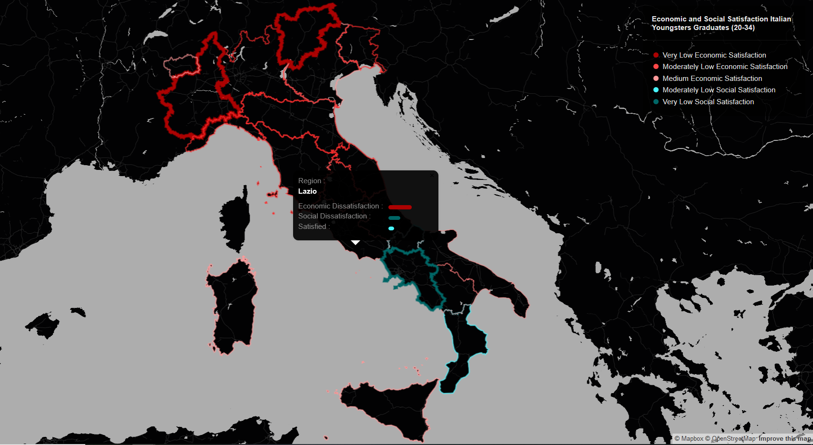

## Spatial Data Science for Sustainability : 
### Economic and Social Satisfaction of Young Italian Graduates

##### The phenomenon known as "brain drain" is a very sensitive and central theme in the socio-political discussion in Italy. This refers to the loss of qualified human capital and the simultaneous lack of brain circulation. As explained by the professor of Demography and Social Statistics of the Catholic University in Milan Alessandro Rosina, the phenomenon is entirely consistent with the development processes of this century. On one hand there is the possibility to travel with short time and limited costs, on the other the attitude of the new generations has also changed, more inclined to move, to interact and confront with different cultures and realities. As the scholar points out, "It is wrong to try to cage your talents. However, even one-way flight is not desirable, because it impoverishes the place of departure." Using the words of E. Durkheim, we could define the pccurence as a social fact characteristic of this century; the problem in Italy is the unidirectional nature of the process: "The optimal condition is instead the circulation, that is, the possibility of being able to go, but with the same ease being able to make the reverse path and return. The issue of Italy are not the many of value that leave, but the few who return. This impoverishes our country. Italy, therefore, is facing a double challenge, the worrying increase in the level of qualified human capital leaving the country and the scarce ability to attract other high level professionals.

